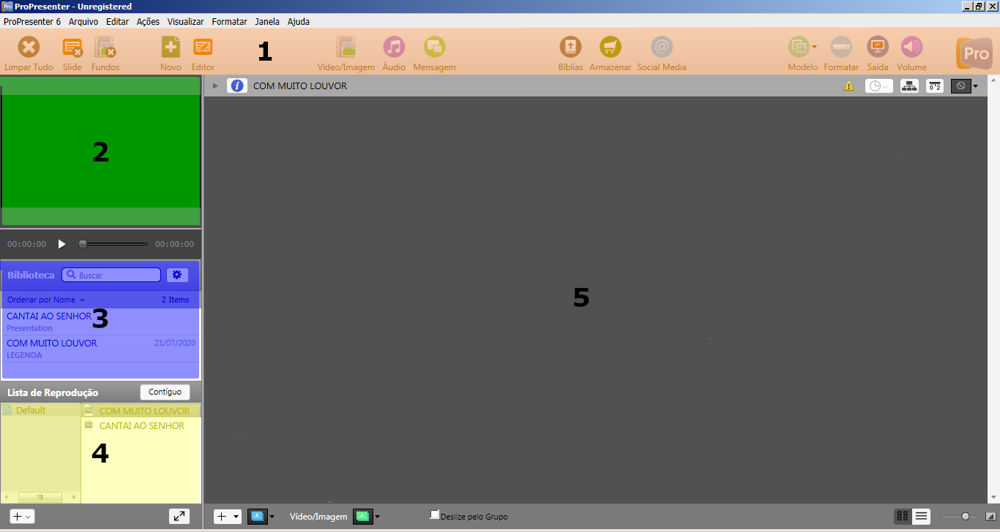
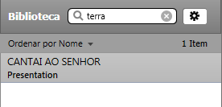
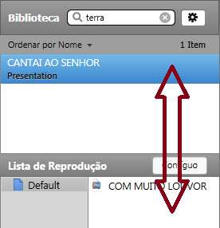

# ProPresenter

## O que é

É um software que pode ser instalado no Windows ou Mac que tem como finalidade principal apresentar as letras dos louvores em uma tela, normalmente a saída é um projetor ou televisão.

## Como utilizamos no Calvário

A saída do ProPresenter vai para um segundo monitor, que é capturado pela [ATEM](/ibcalvariotv/broadcast/equipamentos-e-programas/#atem).

A ATEM por sua vez vai aplicar um filtro de fundo verde nessa imagem e projetar ela sobreposta a outra imagem que estiver em produção ignorando o que estiver em verde.

*Nada impede de utilizar sem o fundo verde, mas é assim que está configurado atualmente.*

## Caminho para aprender ProPresenter

Aqui nesse documento vamos seguir esses passos para explicar basicamente como usamos o ProPresenter no Calvário.
- Detalhar os componentes da janela principal
- Como localizar um louvor.
- Adicionar louvor à lista de reprodução.
- Apresentar as letras dos louvores para a igreja.

## Janela principal

Na janela principal temos as seguintes área importantes:
- *1 Laranja* - Barra de botões, aonde tem, de maneira mais fácil, as principais funcionalidade do programa, atualmente utilizamos mais o botão  "Saída" que serve para fazer com que a imagem de fato apareça na saída ou que nada aconteça. É um botão de liga/desliga.
- *2 Verde* - Pré-Visualização, nesta área é possível ver o mesmo conteúdo que aparece na saída.
- *3 Azul* - Localizador de louvores, aqui é onde digitamos os termos da pesquisa para encontrar um louvor ou item da biblioteca.
- *4 Amarelo* - Lista de reprodução, aqui é onde os louvores ficam agrupados por listas, normalmente tem uma lista que vai ter os louvores do culto daquele dia.
- *5 Cinza* - Aonde ficam os slides (como se fossem páginas) de cada louvor.

## Localizando um louvor

Vamos fazer uma busca simples da um louvor procurando pelos termos do título.\
Para isso basta digitar um termo na caixa de texto, conforme demonstrado na imagem abaixo.

Na biblioteca que montamos para criar esse exemplo temos apenas dois louvores (Cantai ao Senhor e Com muito louvor).\
Então se eu escrever a palavra terra não deve aparecer nada já que essa palavra não está em nenhum dos títulos dos dois louvores, certo?

Por que encontrou a música Cantai ao Senhor que não tem a palavra terra no seu nome?\
Isso aconteceu porque existe uma opção que define quando deve ser incluído na busca também o contéudo do louvor, ou seja, sua letra toda.

Lembra que nesse louvor tem uma parte que diz "Cantai ao Senhor, todas as terras"?\
Repare que não precisou nem estar escrito a palavra terras, isso porque o computador procura por texto (sequencia de caracteres) e não por palavras.

Essa opção está definida como demonstrado na imagem abaixo:

Essa opção é boa quando você lembra uma parte do louvor mas não sabe o nome.

Se essa opção estiver desmarcada a pesquisa será mais rápida, porque só vai procurar pelos títulos.

## Adicionando o louvor à lista de reprodução

Esse passo não é obrigatório, é apenas uma conveniência para não precisar ficar procurando os louvores uma vez que eles já tiverem sido pré-definidos.

Para adicionar à lista de reprodução deve-se arrastar o louvor da área de localização até a lista de reprodução escolhida, como na imagem.\
*Atenção porque no Windows existe um bug que atrapalha esse funcionamento, antes de comecar a arrastar clique e segure o botão do mouse pressionado com ele parado até o título ficar selecionado (azul), depois arraste e solte o botão do mouse.*

## Apresentando as letras dos louvores.

Ao selecionar o louvor, tanto no localizador quanto na lista de reprodução, vai fazer com que os slides apareçam no quadro à direita.

Clicando uma vez em cada slide faz com que ele apareça para a igreja.

Mas para que isso aconteça, dentro do sistema que definimos no Calvário é necessário que **quem estiver operando o Stream Deck, ative a exibição das letras.**

Também é importante ver se, na barra de botões, **o botão Saída está ativado**.\
Se a saída estiver desativada, você vai ver a letra na Pre-visualização, mas não vai aparecer para a igreja.

